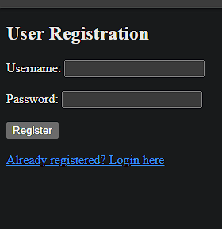
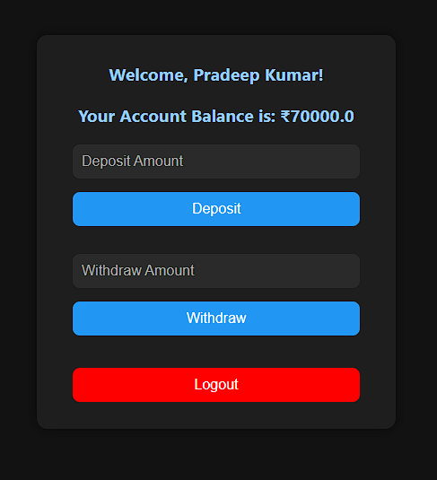

# 💰 Simple Banking Application

[](https://www.oracle.com/java/)
[](https://spring.io/projects/spring-boot)
[](https://www.mysql.com/)
[](https://www.thymeleaf.org/)
[](https://opensource.org/licenses/MIT)

> A full-stack secure banking web application built with Spring Boot, Thymeleaf, and MySQL.  
> Users can register, log in, deposit or withdraw money, and view real-time account balance.  
> All transactions are recorded and persisted in the database.

---

## ✨ Features

- 🔐 Secure user registration and login with Spring Security
- 🔑 Password encryption using BCrypt
- 💰 Deposit and Withdraw functionalities
- 📊 Real-time balance view
- 🧾 Transaction logs stored in MySQL
- 🎨 Clean and responsive UI (Thymeleaf)
- 🔁 Session-based login/logout

---

## 🧱 Technologies Used

| Tech             | Description                        |
|------------------|------------------------------------|
| Java 17          | Programming Language               |
| Spring Boot 3.x  | Backend Framework                  |
| Spring Security  | Authentication & Authorization     |
| Thymeleaf        | Server-side HTML rendering         |
| Spring Data JPA  | ORM layer for database interaction |
| MySQL            | Relational Database                |
| Maven            | Dependency management & build tool |

---

## 📂 Project Structure

simpleBankApp/
├── src/
│ ├── main/
│ │ ├── java/com/bankapp/
│ │ │ ├── model/ # Entity classes
│ │ │ ├── repository/ # JPA interfaces
│ │ │ ├── service/ # Business logic
│ │ │ ├── controller/ # Web controllers
│ │ │ ├── security/ # Custom user details
│ │ │ └── config/ # Spring Security config
│ │ └── resources/
│ │ ├── templates/ # Thymeleaf HTML files
│ │ └── static/css/ # Custom styles
├── .gitignore
├── README.md
└── pom.xml


---

## 📸 Screenshots

> Replace these with actual screenshots after running the app.

### 🔐 Login Page  


### 📝 Registration Page  


### 💻 Dashboard  


---

## ⚙️ How to Run Locally

### 1️⃣ Prerequisites

- Java 17
- Maven
- MySQL (running on `localhost:3306`)

---

### 2️⃣ Clone the Repository

```bash
git clone https://github.com/your-username/simple-bank-app.git
cd simple-bank-app
```

---

### 3️⃣ Create MySQL Database

5️⃣ Run the App

---

4️⃣ Configure application.properties

# src/main/resources/application.properties

-spring.datasource.url=jdbc:mysql://localhost:3306/bankapp
-spring.datasource.username=your_mysql_username
-spring.datasource.password=your_mysql_password
-spring.jpa.hibernate.ddl-auto=update
-spring.jpa.show-sql=true
-spring.thymeleaf.cache=false

---

### 5️⃣ Run the App

./mvnw spring-boot:run
Visit: (http://localhost:8080)

---

👤 User Flow
📝 Register a new account.

🔐 Login using credentials.

💵 Use dashboard to Deposit or Withdraw.

📊 See real-time balance.

🧾 Transactions are saved in the DB.

---

🙋‍♂️ Author
👨‍💻 Pradeep Kumar (Golu)
🔗 GitHub:[ @your-username](https://github.com/pradeepkumar823)
